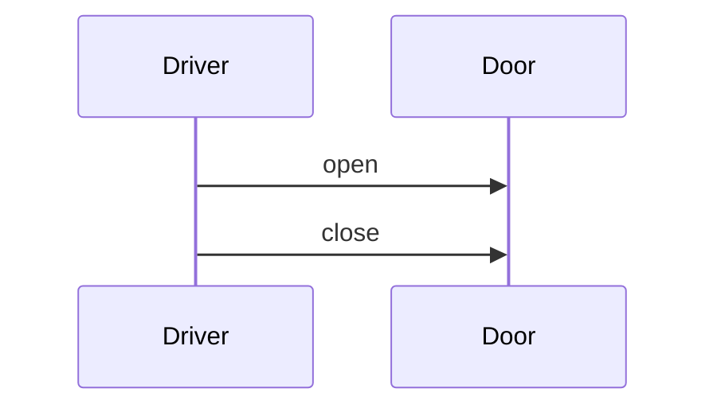

# The door

The door of the garage has four states.

```plantuml
[*] --> Closed
Closed --> Open : open
Open --> Closed : close
```

And this is how a driver leaves:

```mermaid
sequenceDiagram
  Driver->>Door: open
  Driver->>Door: close
```
